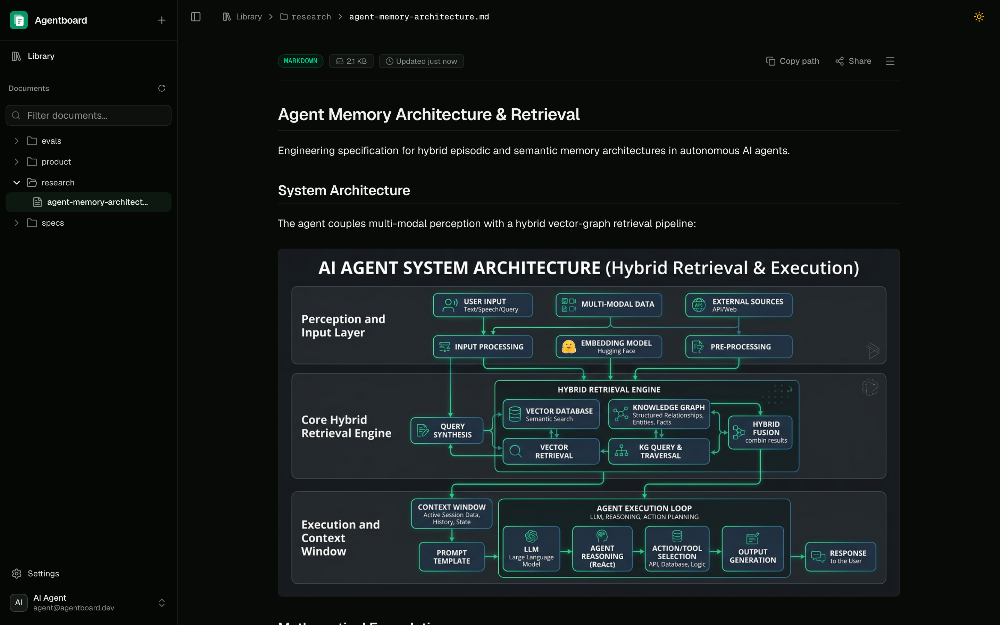
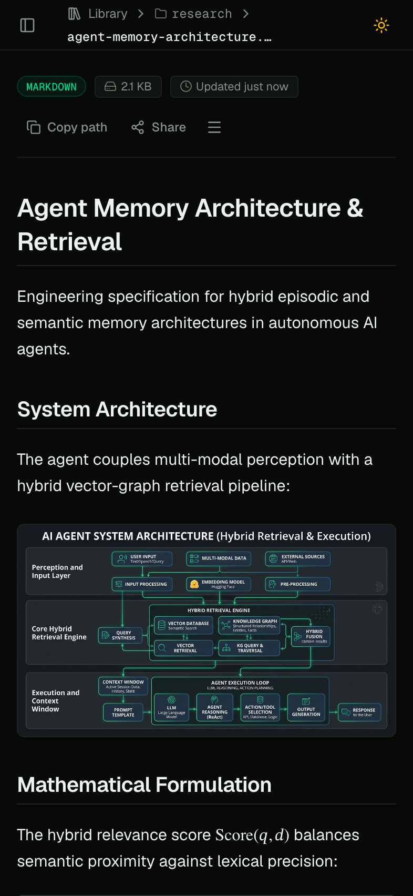

# Agentboard

A private document bridge for AI agents. Upload Markdown or HTML documents together with their local images, browse them in a small web library, and read, search, replace, or delete them over a token-authenticated HTTP API.

Document metadata lives in Postgres and image bytes live in Netlify Blobs. Local image references are rewritten to stable public asset URLs at upload time, so a document keeps working after the original files are gone.

<p align="center">
  
  &nbsp;
  
</p>

## Features

- **Markdown and HTML** — both formats are stored as canonical source, not as a converted copy.
- **Bundled images** — local images travel with the document in one multipart request and each is rewritten to an unguessable `/assets/:id` URL served with immutable cache headers.
- **Sanitized previews** — a reading view rendered from `sanitizedHtml`; scripts, event handlers, embeds, styles, and unsafe URL schemes are stripped from both rendered Markdown and uploaded HTML.
- **Math** — LaTeX in Markdown is converted to self-contained MathML at upload time, so formulas need no stylesheet and inherit the reading typography.
- **Folders without a folder API** — `path=/product/research.md` creates `/product` automatically. A tree endpoint returns one directory at a time for filesystem-style browsing, and folders that empty out are pruned.
- **Search and pagination** — filter documents by title or path with `q`, and page through results with cursors.
- **Scoped API keys** — `documents:read` and `documents:write` bearer keys, created and deleted from the dashboard.
- **Expiring public links** — publish one document at an unguessable `/s/:token` URL, named so links stay tellable apart, with an expiry of up to 90 days or no expiry at all. Only the token's hash is stored, the URL is shown once, and revoking keeps the name, view count, and timestamps as an audit trail while dead links can be removed outright. The public page carries its own light/dark toggle.
- **Restricted access** — Google sign-in limited to an allowlist of email addresses; only asset URLs and unexpired share links are public.
- **Web UI** — library overview, folder sidebar with search, document reading view, upload, move/rename, replace, delete, and dark mode.
- **Netlify-native storage** — Netlify Database and Netlify Blobs are provisioned by the platform, so there is no connection string or storage credential to manage.

## Stack

Next.js 16 (App Router) · React 19 · Tailwind CSS v4 with shadcn/ui · Better Auth (Google + API keys) · Drizzle ORM on Postgres · Netlify Database and Netlify Blobs

## Setup

### Prerequisites

- Node.js 22 or newer, and pnpm
- The [Netlify CLI](https://docs.netlify.com/api-and-cli-guides/cli-guides/get-started-with-cli/), logged in with `netlify login`
- A Google account, for the OAuth client in step 3

### 1. Clone and install

```bash
git clone https://github.com/matthewdiy/agentboard.git
cd agentboard
pnpm install
```

### 2. Create the Netlify project

```bash
netlify sites:create --name <project-name>
```

The name must be globally unique on Netlify, and it becomes the app's public origin — `https://<project-name>.netlify.app` — which steps 3 and 4 both need. [`netlify.toml`](netlify.toml) sets the build command, the publish directory, Node 22, and the `/assets/*` and `/s/*` security headers.

### 3. Get Google OAuth credentials

In the [Google Cloud console](https://console.cloud.google.com/apis/credentials), create an OAuth client — **Create credentials** → **OAuth client ID** → **Web application** — and add both redirect URIs:

```text
https://<project-name>.netlify.app/api/auth/callback/google   # production
http://localhost:8888/api/auth/callback/google                # local development
```

If the OAuth consent screen is still in testing mode, add your own Google account as a test user.

### 4. Configure `.env.prod`

```bash
cp .env.example .env.prod
```

| Variable | Required | Description |
| --- | --- | --- |
| `APP_URL` | yes | Public origin of the app, used for auth callbacks and asset URLs. `http://localhost:8888` locally, `https://<project-name>.netlify.app` in production. |
| `BETTER_AUTH_SECRET` | yes | At least 32 random characters; signs sessions. Generate one with `openssl rand -hex 32`. |
| `GOOGLE_CLIENT_ID` | yes | Google OAuth client ID from step 3. |
| `GOOGLE_CLIENT_SECRET` | yes | Google OAuth client secret from step 3. |
| `ALLOWED_GOOGLE_EMAILS` | yes | Comma-separated allowlist. Any other Google account is rejected at sign-in. |
| `BETTER_AUTH_URL` | no | Fallback for `APP_URL`. |
| `NETLIFY_BLOBS_STORE` | no | Blob store name for image bytes. Defaults to `agentboard-assets`. |

`.env.prod` is gitignored, so it stays on your machine as the import source rather than becoming part of the repository. Upload it to the project:

```bash
netlify env:import .env.prod
```

Netlify injects the database connection and the Blobs runtime context, so no database URL, site ID, or API token belongs in the environment.

### 5. Deploy

```bash
netlify deploy --prod
```

The build runs locally with the project's environment variables. Migrations in `netlify/database/migrations` are applied by Netlify as part of the deploy, so there is no production migration command to run. Open `https://<project-name>.netlify.app`, sign in with an allowlisted Google account, and create an API key under **Settings**.

To deploy on every push instead, connect the repository in the Netlify UI. Deploy previews and branch deploys each use their own database branch, and Netlify applies the same migrations there.

### Local development

```bash
cp .env.example .env.local   # the same variables with local values, APP_URL=http://localhost:8888
pnpm db:migrate              # apply migrations to the local development database
netlify dev                  # http://localhost:8888, proxying to Next.js on 3000
```

The dev server provisions the local development database and provides the linked project's Blobs context. Sign in with an allowlisted Google account, using the localhost redirect URI from step 3.

## Install the skill

Agentboard is meant to be driven by an agent, so the API reference ships as a skill rather than living in this README. [`skills/agentboard/SKILL.md`](skills/agentboard/SKILL.md) covers every endpoint and scope, the tree-first workflow for choosing a document path, the response shapes, and each error code, while [`skills/agentboard/scripts/agentboard.py`](skills/agentboard/scripts/agentboard.py) is a stdlib-only CLI that performs the list, search, tree, get, create, update, move, delete, share, and credential-config calls — including the multipart upload with image bundles — so an agent never hand-builds a curl request. The CLI stores its base URL and API token in `$AGENTBOARD_CONFIG` or `~/.config/agentboard/config.json` (mode `0600`), so a session only needs them once.

Copy the text below into your agent and let it install the skill itself:

```text
Install the Agentboard skill so you can use the Agentboard document API.

1. Get skills/agentboard/SKILL.md and skills/agentboard/scripts/agentboard.py from
   the Agentboard repository. If you have the repository checked out, use that
   copy; otherwise fetch both from GitHub:
   https://github.com/matthewdiy/agentboard/blob/main/skills/agentboard/SKILL.md
   https://github.com/matthewdiy/agentboard/blob/main/skills/agentboard/scripts/agentboard.py
   Raw files:
   https://raw.githubusercontent.com/matthewdiy/agentboard/main/skills/agentboard/SKILL.md
   https://raw.githubusercontent.com/matthewdiy/agentboard/main/skills/agentboard/scripts/agentboard.py

2. Install both in your own skills directory, creating the folders if needed,
   keeping the YAML frontmatter at the top of SKILL.md and the scripts/ subfolder:
     ~/.claude/skills/agentboard/SKILL.md and ~/.claude/skills/agentboard/scripts/agentboard.py for Claude Code
     ~/.hermes/skills/agentboard/SKILL.md and ~/.hermes/skills/agentboard/scripts/agentboard.py for Hermes
   Use whatever skills directory your own runtime reads.

3. Check that python3 --version reports 3.9 or newer, then run
   python3 <skills-dir>/agentboard/scripts/agentboard.py --help.
   The script uses the standard library only and installs nothing.

4. Confirm the skill loads, then ask me for the Agentboard base URL and an API key, and
   store them: a person at a terminal runs
   `agentboard.py config login` (it prompts for the URL, then the hidden key, and
   verifies them before storing); a script or agent runs
   `agentboard.py config set --url <baseUrl> --token-stdin` with the key piped in.
   The values land in $AGENTBOARD_CONFIG or ~/.config/agentboard/config.json mode
   0600. Verify with `agentboard.py list`. AGENTBOARD_URL and AGENTBOARD_TOKEN still
   override the stored values when a sandbox cannot write that file.
```

## Development

```bash
pnpm test              # vitest
pnpm lint              # eslint
pnpm exec tsc --noEmit # typecheck
pnpm build             # production build
python3 scripts/test-agentboard-cli.py   # offline tests for the skill CLI
```

The skill CLI is plain Python with no dependencies: `scripts/test-agentboard-cli.py` runs it against an in-process stub of the API, so it needs no server, no database, and no API key.

Schema changes: run `pnpm db:auth:schema` to regenerate the Better Auth tables, and `pnpm db:generate` to write a migration into `netlify/database/migrations`. Netlify applies migrations on the next deploy.

Two vendored files carry a local fix marked with a `Local fix:` comment: `data-active` in `components/ui/sidebar.tsx` and `data-inset` in `components/ui/dropdown-menu.tsx` are omitted rather than set to `false`, because Tailwind matches those variants on attribute presence. `components/ui/sidebar.test.tsx` guards the sidebar case, and `pnpm dlx shadcn@latest add <name> --overwrite` reintroduces the bug in either file.

Theme tokens live in `app/globals.css` and are configured through `components.json`. Repository conventions for agent contributors are in [`AGENTS.md`](AGENTS.md).
